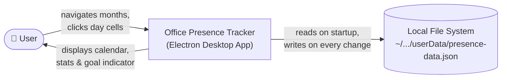

# 3. Context & Scope

## System Boundary

The Office Presence Tracker is entirely self-contained. It has no integration with external APIs, authentication providers, calendar services, or HR systems. Its only external interactions are:

- **The user** — who navigates months and clicks day cells
- **The local file system** — where the application reads and writes the planning data JSON file

## What Is Inside the System Boundary

| Element | Responsibility |
|---------|---------------|
| Calendar UI | Render the month grid; handle day clicks and month navigation |
| Status management | Cycle day statuses (home-office → on-site → absent → home-office) |
| Holiday service | Derive Bavarian public holidays for any year, including moveable feasts |
| Working-time calculator | Compute on-site %, home-office %, and day counts from the current month's statuses |
| Goal indicator | Evaluate the 40% threshold and apply appropriate visual styling |
| Persistence layer | Read the JSON file at startup; write the JSON file on every status change |

> **Note:** The application reads the current date from the OS system clock on launch to determine the default displayed month (REQ-001). This is a passive local dependency — no network or external service integration is involved.

## What Is Outside the System Boundary

| Element | Reason excluded |
|---------|----------------|
| HR or calendar systems | No integration required (standalone planning tool) |
| Authentication | Single-user personal tool; no identity management needed |
| Cloud storage or sync | Out of scope per REQ-007; local-only |
| Push notifications or reminders | Not in requirements |
| Other German states / countries | Only Bavarian holidays are in scope (REQ-006) |
