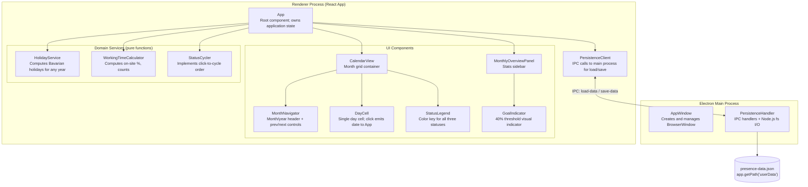

# 5. Building Block View

## Level 1 — System Context

The system has two processes: the Electron **main process** and the **renderer process**. They are separated by Electron's process boundary and communicate via IPC.



## Level 2 — Component Descriptions

### Main Process

#### AppWindow
Responsible for creating the `BrowserWindow` instance and loading the renderer HTML. Configures the window with appropriate dimensions for the two-panel layout (calendar + overview), with `minWidth: 1280, minHeight: 800` per REQ-009. Registers the preload script that exposes the `contextBridge` API.

#### PersistenceHandler
Registers IPC listeners (`ipcMain.handle`) for two channels:
- `load-data` — reads the JSON file from `app.getPath('userData')/presence-data.json`; returns an empty object if the file does not exist
- `save-data` — receives the full sparse data object from the renderer and writes it asynchronously to disk

### Renderer Process

#### App
The root React component. Owns the entire application state:
- `currentMonth: { year: number, month: number }` — the currently displayed month
- `dayStatuses: Record<string, DayStatus>` — the sparse map of all persisted statuses (key: `YYYY-MM-DD`)
- `holidays: Set<string>` — computed via `useMemo` keyed on `currentMonth.year`; passed down to `CalendarView`

On mount, calls `PersistenceClient.loadData()` to hydrate state from disk. Passes derived data (holidays for the current year, calculated stats) down to child components as props.

**Key rule — sparse model enforcement:** When a day's new status is `home-office`, its key is removed from the `dayStatuses` map before calling `PersistenceClient.saveData`. This enforces the sparse model (ADR-003).

**Status change handler:** `App.onStatusChange(date: string)` calls `StatusCycler.nextStatus(currentStatus)` to compute the new status, then updates `dayStatuses` accordingly (removing the key if the new status is `home-office`), triggers a re-render, and calls `PersistenceClient.saveData` asynchronously.

#### CalendarView
Renders the monthly grid. Derives the set of weeks (arrays of day objects) from `currentMonth` and passes each day's status, holiday flag, and weekend flag to individual `DayCell` components. Contains `MonthNavigator` at the top and `StatusLegend` below the grid.

Generates padding day objects for partial first/last weeks, each carrying `isAdjacentMonth: true`. `DayCell` renders these muted and suppresses all click events when this flag is set.

Receives `holidays: Set<string>` as a prop from `App`. For each day object it passes `isHoliday: holidays.has(dateString)` to `DayCell`.

#### MonthNavigator
Stateless component. Displays the current month and year as a heading. Emits `onPrevMonth` and `onNextMonth` events up to `App`.

#### DayCell
Renders a single calendar cell. Applies CSS classes based on: status (home-office, on-site, absent), weekend, holiday, or adjacent-month.

DayCell is a fully controlled component with no local state. Its prop interface is:

```typescript
{
  date: string;           // YYYY-MM-DD
  status: DayStatus;
  isWeekend: boolean;
  isHoliday: boolean;
  isAdjacentMonth: boolean;
  onStatusChange: (date: string) => void;
}
```

Clicking a valid (non-weekend, non-holiday, current-month) cell emits a raw click event — `onStatusChange(date)` — up to `App`. DayCell does **not** call `StatusCycler` itself; `App.onStatusChange` is responsible for computing the new status. Click events are suppressed when `isAdjacentMonth` is `true`.

#### StatusLegend
Stateless component. Renders three colored swatches with labels: home-office, on-site, absent.

#### MonthlyOverviewPanel
Receives the calculated `MonthStats` object as a prop and renders all statistics. Contains `GoalIndicator` as a sub-component for the on-site percentage.

#### GoalIndicator
Stateless component. Receives `onSitePercentage: number`. Renders the percentage value and applies green or warning styling depending on whether the value meets the 40% threshold.

### Domain Services

#### HolidayService
A module of pure functions. Exports:
- `getBavarianHolidays(year: number): Set<string>` — returns a set of `YYYY-MM-DD` strings for all 13 Bavarian public holidays in the given year
- `computeEaster(year: number): Date` — implements the Computus algorithm to find Easter Sunday; used internally to derive moveable feasts

Note: `computeEaster` is exported solely to enable direct unit testing against known Easter dates (R-02 mitigation). It is not part of the module's public interface for application use.

#### WorkingTimeCalculator
A module of pure functions. Exports:

```typescript
calculateMonthStats(
  year: number,
  month: number,       // 1-indexed: 1 = January, 12 = December (consistent with ISO 8601 date strings)
  dayStatuses: Record<string, DayStatus>,
  holidays: Set<string>
): MonthStats
```

The function always processes all working days in the month, including future days. For days with no entry in `dayStatuses`, the home-office default is applied (sparse model). This satisfies REQ-005: the goal indicator evaluates the full month plan regardless of the current date.

`MonthStats` contains:
- `totalWorkingDays: number` — non-holiday weekdays
- `onSiteDays: number`
- `homeOfficeDays: number`
- `absentDays: number`
- `onSitePercentage: number` — `onSiteDays / (onSiteDays + homeOfficeDays) * 100`, or 0 if denominator is 0
- `homeOfficePercentage: number` — `homeOfficeDays / (onSiteDays + homeOfficeDays) * 100`, or 0 if denominator is 0. **Not** derived as `100 - onSitePercentage` (to avoid NaN on zero-denominator edge case).

#### StatusCycler
A module of pure functions. Exports:
- `nextStatus(current: DayStatus): DayStatus` — implements the cycle: home-office → on-site → absent → home-office

#### PersistenceClient
A thin wrapper over the `contextBridge` API exposed by the preload script. Formal interface:

```typescript
window.presenceAPI.loadData(): Promise<Record<string, DayStatus>>
window.presenceAPI.saveData(data: Record<string, DayStatus>): Promise<void>
```

`saveData` returns a rejectable `Promise` so that write errors can propagate to future error-handling logic (currently logged only in v1).

The project must include a TypeScript declaration file (e.g., `src/renderer/preload.d.ts`) augmenting the `Window` interface:

```typescript
interface Window {
  presenceAPI: {
    loadData(): Promise<Record<string, DayStatus>>;
    saveData(data: Record<string, DayStatus>): Promise<void>;
  };
}
```

This is required for the renderer TypeScript to compile.

## Data Model

The `DayStatus` type is defined as:

```typescript
type DayStatus = 'home-office' | 'on-site' | 'absent';
```

In-memory, `dayStatuses: Record<string, DayStatus>` may hold all three values. The persisted JSON file stores only `'on-site'` and `'absent'` entries (sparse model): `'home-office'` days are represented by the absence of a key.

The persisted JSON file has the following structure:

```json
{
  "2026-04-07": "on-site",
  "2026-04-15": "absent",
  "2026-05-03": "on-site"
}
```

Keys are ISO 8601 dates (`YYYY-MM-DD`). Values are the string literals `"on-site"` or `"absent"`. Days with status `"home-office"` are **not stored** (sparse model). The entire file is the single top-level object — no versioning or envelope is required for v1.

> **Note:** A schema version field is intentionally omitted in v1; see TD-02 for the migration risk this introduces.
