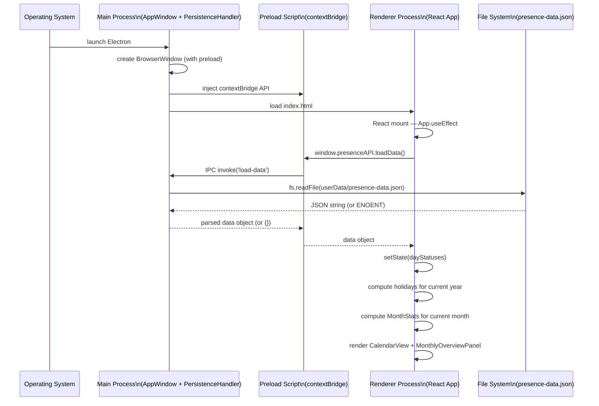
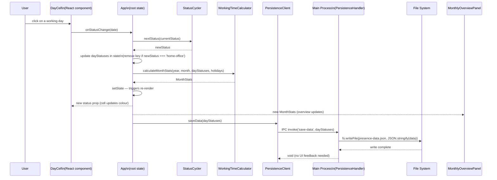
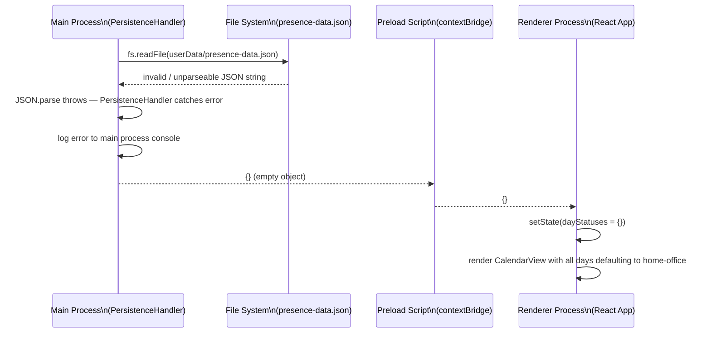

# 6. Runtime View

## Scenario 1 — Application Startup

When the user launches the application, the main process creates the window and the renderer process loads persisted data before rendering the calendar.



## Scenario 2 — Day Status Change

When the user clicks a day cell, the raw click event (date only) is emitted to `App`. `App` computes the new status via `StatusCycler`, updates state, and persists asynchronously.



Note: the save is fire-and-forget from the UI's perspective — the visual update happens before the file write completes.

## Scenario 3 — Month Navigation

When the user clicks the forward or backward navigation control, the displayed month changes and all derived data recomputes.

```mermaid
sequenceDiagram
    participant User as User
    participant Nav as MonthNavigator
    participant App as App\n(root state)
    participant Holiday as HolidayService
    participant Calc as WorkingTimeCalculator

    User->>Nav: click next/prev month button
    Nav->>App: onNextMonth() or onPrevMonth()
    App->>App: update currentMonth state\n(year/month adjusted, wraps Jan↔Dec)
    App->>Holiday: getBavarianHolidays(newYear)\n(via useMemo keyed on year; recomputed only when year changes)
    Holiday-->>App: Set<string> of holiday dates
    App->>Calc: calculateMonthStats(newYear, newMonth, dayStatuses, holidays)
    Calc-->>App: MonthStats
    App->>App: setState — triggers re-render
    App-->>CalendarView: new month grid (with holiday flags)
    App-->>MonthlyOverviewPanel: new MonthStats
```

No persistence occurs during month navigation — the user is only changing the view; the underlying data is unchanged.

## Scenario 4 — Corrupted or Unparseable JSON File

When the persisted JSON file exists but cannot be parsed (e.g., truncated due to a crash during a previous write), the application recovers gracefully and starts with a clean state.



The application starts with all days defaulting to home-office, as if no data had ever been saved.
