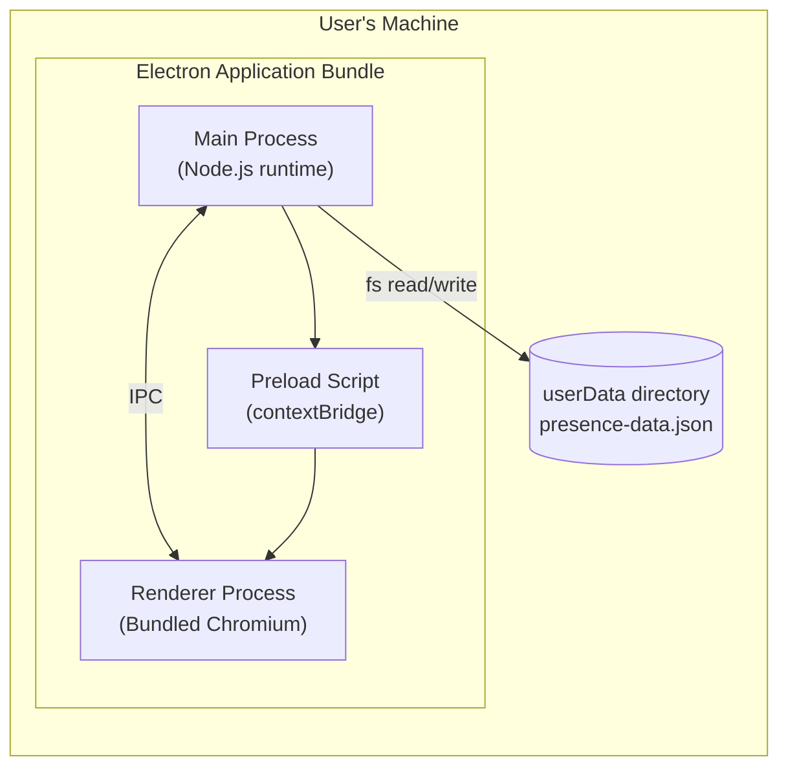

# 7. Deployment View

## Runtime Environment

Presency is a standalone Electron application. There is no server component. The entire application runs on the user's machine as a single desktop process (with Electron's inherent main + renderer sub-processes).



## Distribution Targets

| Platform | Artifact | Build Tool |
|---------|---------|-----------|
| macOS | `.app` bundle (packaged as `.dmg` or `.zip`) | electron-builder |
| Windows | `.exe` installer or portable binary | electron-builder |
| Linux | AppImage | electron-builder |

All three targets are produced by a single `npm run build` (or equivalent) invocation of `electron-builder`.

## Data Location

The persistence file is stored at the path returned by `app.getPath('userData')`, which resolves to:

| Platform | Default Path |
|---------|-------------|
| macOS | `~/Library/Application Support/<AppName>/presence-data.json` |
| Windows | `%APPDATA%\<AppName>\presence-data.json` |
| Linux | `~/.config/<AppName>/presence-data.json` |

`<AppName>` is anchored by the `productName` field in the electron-builder configuration (see Build Process below).

## Build Process

```
Source (TypeScript + React)
    → electron-vite (separate compilation of main / renderer / preload)
    → electron-builder (package main + renderer + Chromium)
    → Platform-specific binary
```

See ADR-008 for the rationale for choosing electron-vite over Webpack/Electron Forge.

No CI/CD pipeline is defined for v1. The developer runs the build locally.

### electron-builder Configuration Requirements

The `electron-builder` configuration (in `package.json` or a dedicated config file) must specify at minimum:

| Key | Purpose |
|-----|---------|
| `appId` | Unique application identifier (e.g., `dev.evodicka.presency`) |
| `productName` | Human-readable name; anchors the `userData` path (`<AppName>`) on all platforms |
| `files` | Glob pattern(s) selecting which output files to include in the package |
| `mac` / `win` / `linux` | Platform-specific target formats (e.g., `dmg`, `nsis`, `AppImage`) |

## Runtime Environment — Window Constraints

| Constraint | Value | Source |
|-----------|-------|--------|
| Minimum window width | 1280 px | REQ-009 |
| Minimum window height | 800 px | REQ-009 |

`BrowserWindow` is created with `minWidth: 1280, minHeight: 800` to enforce these constraints (see AppWindow in Section 05).

## Runtime Dependencies

The application has no runtime dependencies beyond the Electron binary itself (which bundles Node.js and Chromium). No internet access, external services, or installed runtimes are required on the user's machine.
