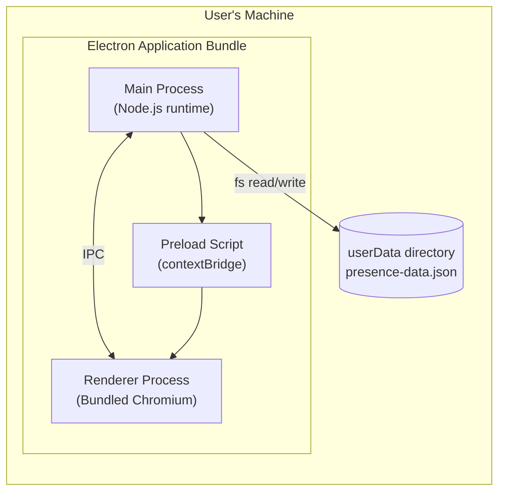
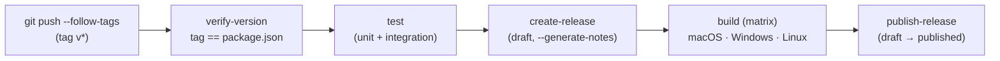

# 7. Deployment View

## Runtime Environment

Presency is a standalone Electron application. There is no server component. The entire application runs on the user's machine as a single desktop process (with Electron's inherent main + renderer sub-processes).



## Distribution Targets

| Platform | Artifact | Build Tool |
|---------|---------|-----------|
| macOS | `.app` bundle (packaged as `.dmg` or `.zip`) | electron-builder |
| Windows | `.exe` installer or portable binary | electron-builder |
| Linux | AppImage | electron-builder |

All three targets are produced by a single `npm run build` (or equivalent) invocation of `electron-builder`.

## Data Location

The persistence file is stored at the path returned by `app.getPath('userData')`, which resolves to:

| Platform | Default Path |
|---------|-------------|
| macOS | `~/Library/Application Support/<AppName>/presence-data.json` |
| Windows | `%APPDATA%\<AppName>\presence-data.json` |
| Linux | `~/.config/<AppName>/presence-data.json` |

`<AppName>` is anchored by the `productName` field in the electron-builder configuration (see Build Process below).

## Build Process

```
Source (TypeScript + React)
    → electron-vite (separate compilation of main / renderer / preload)
    → electron-builder (package main + renderer + Chromium)
    → Platform-specific binary
```

See ADR-008 for the rationale for choosing electron-vite over Webpack/Electron Forge.

Local builds (`npm run build` followed by `npx electron-builder`) remain supported for development. Production releases run through the GitHub Actions Release Pipeline described below.

### electron-builder Configuration Requirements

The `electron-builder` configuration (in `package.json` or a dedicated config file) must specify at minimum:

| Key | Purpose |
|-----|---------|
| `appId` | Unique application identifier (e.g., `dev.evodicka.presency`) |
| `productName` | Human-readable name; anchors the `userData` path (`<AppName>`) on all platforms |
| `files` | Glob pattern(s) selecting which output files to include in the package |
| `mac` / `win` / `linux` | Platform-specific target formats (e.g., `dmg`, `nsis`, `AppImage`) |

## Release Pipeline

Production releases are produced by the GitHub Actions workflow in `.github/workflows/release.yml`. The pipeline is **tag-driven**: pushing a Git tag matching `v*` (for example, `v1.0.1` or `v1.0.1-beta.0`) triggers a full build-and-release run across macOS, Windows, and Linux. No manual intervention in the GitHub UI is required.

### Pipeline graph



| Job | Purpose |
|-----|---------|
| `verify-version` | Compares `$GITHUB_REF_NAME` against `v$(node -p "require('./package.json').version")`. Fails the run on mismatch — see ADR-009. |
| `test` | Reuses `.github/workflows/test.yml` to run the unit and integration suites with their coverage gates (90% / 80%). |
| `create-release` | Single ubuntu runner. Creates a *draft* GitHub Release for the tag with `gh release create --generate-notes --draft`. Adds `--prerelease` automatically when the tag contains a hyphen (e.g. `v1.0.1-beta.0`). Must be a single job because invoking `gh release create` from each matrix runner would race and produce `422 already_exists`. |
| `build` (matrix) | Three parallel runners (`macos-latest`, `windows-latest`, `ubuntu-latest`) execute `npm ci`, `npm run build:icons`, `npm run build`, then `npx electron-builder` with the platform flag. Each runner uploads its installer (`.dmg` / `.exe` / `.AppImage`) to the draft release with `gh release upload "$GITHUB_REF_NAME"`. |
| `publish-release` | After all three matrix legs succeed, flips the draft to published with `gh release edit --draft=false`. Putting the flip in a final job (rather than inside the matrix) ensures a partial-failure release stays as a draft for inspection rather than going public half-uploaded. |

### Maintainer ritual

Cutting a release is a single local operation:

```bash
npm version <patch|minor|major>   # bumps package.json + package-lock.json, commits, creates annotated tag vX.Y.Z
git push --follow-tags             # pushes the bump commit and the tag
```

Prereleases are cut the same way using `npm version prerelease --preid=beta`, producing tags like `v1.0.1-beta.0` that the pipeline routes to a GitHub Release marked *Pre-release*.

### Version-tag invariant

The `package.json` `version` field is the **single source of truth** for the application version. The Git tag is mechanically derived from it by `npm version` and is never edited by hand. The `verify-version` job enforces equality between the two on every release run; if they ever diverge, the run fails before any artifact is built or uploaded. See ADR-009 for the rationale and trade-offs.

### Failure recovery

If a release run fails partway through, the draft release remains in place for inspection and the tag has already been pushed. Recovery depends on the cause:

1. **Transient failure** (flaky test, runner timeout, network blip) — re-run the failed job from the GitHub Actions UI. No tag manipulation is needed; the existing tag and draft release are reused.
2. **Real defect that requires a code fix** — Git tags are immutable in the release flow, so the same version cannot be re-released. Delete the draft release in the GitHub UI, delete the local and remote tag (`git tag -d vX.Y.Z && git push --delete origin vX.Y.Z`), commit the fix, and run `npm version <patch>` again to produce the next version (`vX.Y.Z+1`). Force-pushing the same tag to a new commit is technically possible but is avoided because uploaded installers from the partial run would still reference the original commit.

## Runtime Environment — Window Constraints

| Constraint | Value | Source |
|-----------|-------|--------|
| Minimum window width | 1280 px | REQ-009 |
| Minimum window height | 800 px | REQ-009 |

`BrowserWindow` is created with `minWidth: 1280, minHeight: 800` to enforce these constraints (see AppWindow in Section 05).

## Runtime Dependencies

The application has no runtime dependencies beyond the Electron binary itself (which bundles Node.js and Chromium). No internet access, external services, or installed runtimes are required on the user's machine.
