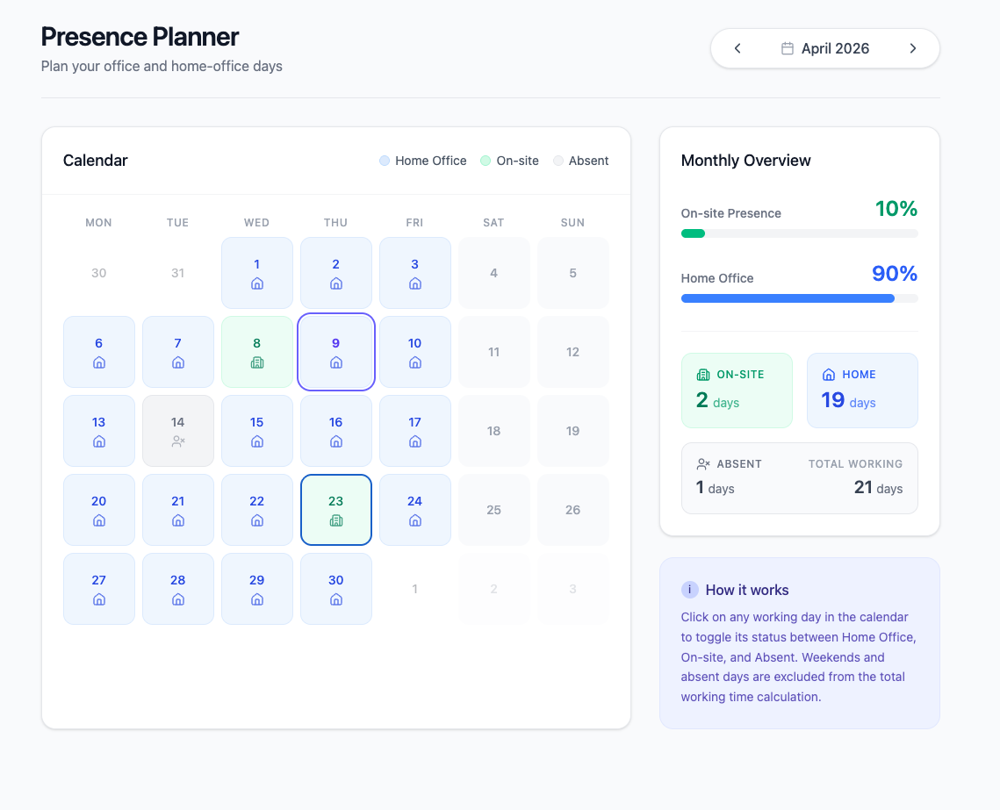

# Description
The tool allows calculating how much of the total working time of a month is spent in the office. It should be possible to plan presence days for the upcoming month

# User Interface
The tool will show a calendar view for each month. It is possible to change the month. Each day can have a different status (indicate by color):
* home-office (default)
* on-site
* absent
It is possible to change the status for each day. Next to the calendar, there is an overview that shows, how much of the total working time of this month is spent on-site or at home.

Create a fresh looking user interface that looks somehting as

# Key Facts
* Working time is 8 hours a day, Mo-Fr
* Weekends and public holidays (in Germany/Bavaria) are not calculated to the total working time
* Absences are not calculated against the total working time
* The goal is to reach at least 40% office time. Highlight in Green, when this goal is reached
* The tool should run locally (no server required)
  * Ideally it is simple runnable application
  * It should persist any entered data (status of each day)
  * It should be usable on any desktop platform (mac, windows, linux)